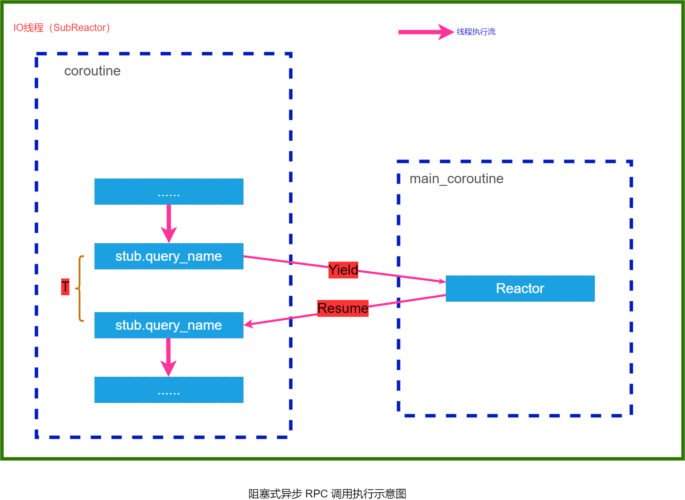
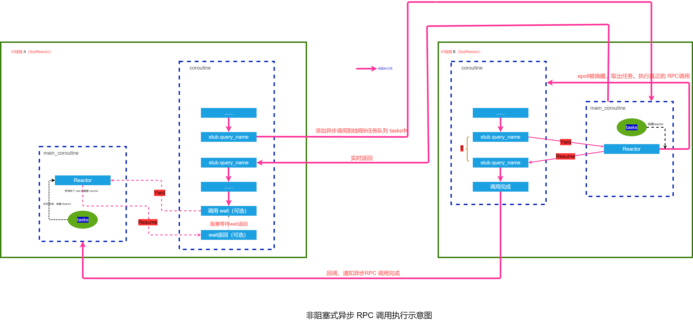
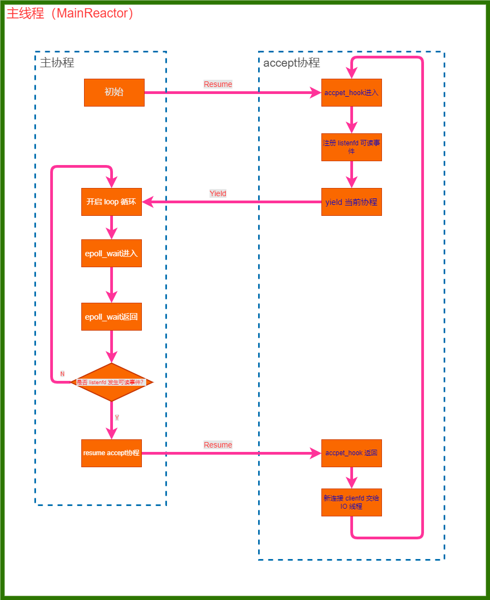
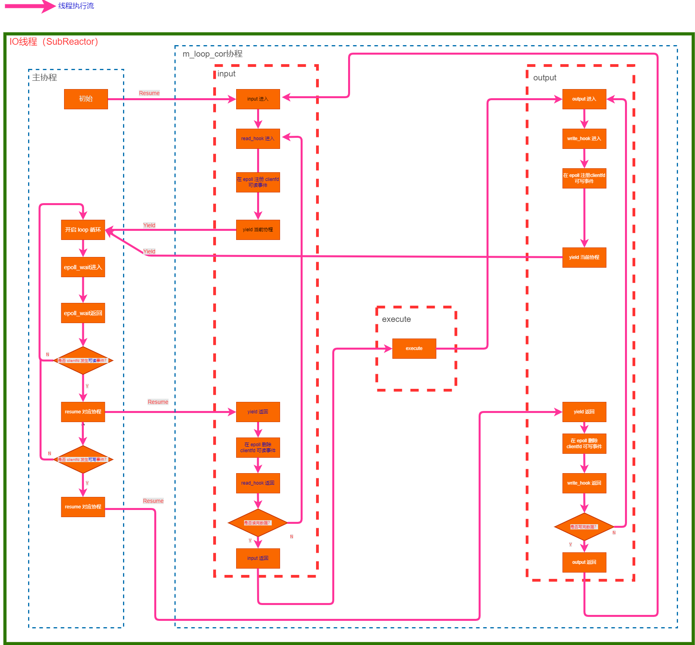

       


作者：**ikerli**  **2022-05-13**
**使用 TinyRPC, 轻松地构建高性能分布式 RPC 服务！**

<!-- TOC -->

- [1. 概述](#1-概述)
  - [1.1. TinyRPC 特点](#11-tinyrpc-特点)
  - [1.2. TinyRPC 支持的协议报文](#12-tinyrpc-支持的协议报文)
  - [1.3. TinyRPC 的 RPC 调用](#13-tinyrpc-的-rpc-调用)
    - [1.3.1. 阻塞协程式异步调用](#131-阻塞协程式异步调用)
    - [1.3.2. 非阻塞协程式异步调用](#132-非阻塞协程式异步调用)
- [2. 性能测试](#2-性能测试)
  - [2.1. HTTP echo 测试 QPS](#21-http-echo-测试-qps)
- [3. 安装 TinyRPC](#3-安装-tinyrpc)
  - [3.1. 安装必要的依赖库](#31-安装必要的依赖库)
    - [3.1.1. protobuf](#311-protobuf)
    - [3.1.2. tinyxml](#312-tinyxml)
  - [3.2. 安装和卸载 (makefile)](#32-安装和卸载-makefile)
    - [3.2.1. 安装 TinyRPC](#321-安装-tinyrpc)
    - [3.2.2. 卸载 TinyRPC](#322-卸载-tinyrpc)
  - [3.3. 安装和卸载 (cmake)](#33-安装和卸载-cmake)
    - [3.3.1. 安装 TinyRPC](#331-安装-tinyrpc)
    - [3.3.2. 卸载 TinyRPC](#332-卸载-tinyrpc)
- [4. 快速上手](#4-快速上手)
  - [4.1. 搭建基于 TinyPB 协议的 RPC 服务](#41-搭建基于-tinypb-协议的-rpc-服务)
    - [4.1.1. 实现 Protobuf 文件接口](#411-实现-protobuf-文件接口)
    - [4.1.2. 准备配置文件](#412-准备配置文件)
    - [4.1.3. 实现业务接口](#413-实现业务接口)
    - [4.1.4. 启动 RPC 服务](#414-启动-rpc-服务)
  - [4.2. 搭建基于 HTTP 协议的 RPC 服务](#42-搭建基于-http-协议的-rpc-服务)
    - [4.2.1. 准备配置文件](#421-准备配置文件)
    - [4.2.2. 实现 Servlet 接口](#422-实现-servlet-接口)
    - [4.2.3. 启动 RPC 服务](#423-启动-rpc-服务)
  - [4.3. RPC 服务调用](#43-rpc-服务调用)
    - [4.3.1. 阻塞协程式异步调用](#431-阻塞协程式异步调用)
    - [4.3.2. 非阻塞协程式异步调用](#432-非阻塞协程式异步调用)
  - [4.4. TinyRPC 脚手架(tinyrpc_generator)](#44-tinyrpc-脚手架tinyrpc_generator)
    - [4.4.1 准备 protobuf 文件](#441-准备-protobuf-文件)
    - [4.4.2 生成 TinyRPC 框架](#442-生成-tinyrpc-框架)
    - [4.4.3 业务逻辑开发](#443-业务逻辑开发)
    - [4.4.4 Protobuf 接口升级怎么办？](#444-protobuf-接口升级怎么办)
    - [4.4.5 tinyrpc_generator 选项详解](#445-tinyrpc_generator-选项详解)
- [5. 概要设计](#5-概要设计)
  - [5.1. 异步日志模块](#51-异步日志模块)
  - [5.2. 协程模块](#52-协程模块)
    - [5.2.1. 协程封装](#521-协程封装)
    - [5.2.2. m:n 线程:协程模型](#522-mn-线程协程模型)
  - [5.3. Reactor 模块](#53-reactor-模块)
  - [5.4. Tcp 模块](#54-tcp-模块)
    - [5.4.1. TcpServer](#541-tcpserver)
    - [5.4.2. TcpConnection](#542-tcpconnection)
  - [5.5. TinyPB 协议](#55-tinypb-协议)
    - [5.5.1. TinyPB 协议报文格式分解](#551-tinypb-协议报文格式分解)
  - [5.6. Http 模块](#56-http-模块)
  - [5.7. RPC 调用封装](#57-rpc-调用封装)
- [6. 错误码](#6-错误码)
  - [6.1. 错误码判断规范](#61-错误码判断规范)
  - [6.2. 错误码释义文档](#62-错误码释义文档)
- [7. 问题反馈](#7-问题反馈)
- [8. 参考资料](#8-参考资料)

<!-- /TOC -->


# 1. 概述
## 1.1. TinyRPC 特点
**TinyRPC** 是一款基于 **C++11** 标准开发的小型**异步 RPC** 框架。TinyRPC 的核心代码应该也就几千行样子，尽量保持了简洁且较高的易读性。

麻雀虽小五脏俱全，从命名上就能看出来，TinyRPC 框架主要用义是为了让读者能**快速地**、**轻量化**地搭建出具有较高性能的异步RPC 服务。至少用 TinyRPC 搭建的 RPC 服务能应付目前大多数场景了。

**TinyRPC** 没有实现跨平台，只支持 Linux 系统，并且必须是 64 位的系统，因为协程切换只实现了 **64** 位系统的代码，而没有兼容 **32** 位系统。这是有意的，因为作者只会 Linux 下开发，没能力做到跨平台。


**TinyRPC** 的核心思想有两个：
1. 让搭建高性能 RPC 服务变得简单
2. 让异步调用 RPC 变得简单

必须说明的是， **TinyRPC** 代码没有达到工业强度，最好不要直接用到生产环境，也可能存在一些未知 BUG，甚至 coredump。读者请自行辨别，谨慎使用！


## 1.2. TinyRPC 支持的协议报文
**TinyRPC** 框架目前支持两类协议：
1. 纯 **HTTP** 协议: TinyRPC 实现了简单的很基本的 HTTP(1.1) 协议的编、解码，完全可以使用 HTTP 协议搭建一个 RPC 服务。
2. TinyPB 协议: 一种基于 **Protobuf** 的自定义协议，属于二进制协议。

## 1.3. TinyRPC 的 RPC 调用
TinyRPC 是一款异步的 RPC 框架，这就意味着服务之前的调用是非常高效的。目前来说，TinyRPC 支持两种RPC 调用方式：**阻塞协程式异步调用** 和 **非阻塞协程式异步调用**。

### 1.3.1. 阻塞协程式异步调用

阻塞协程式异步调用这个名字看上去很奇怪，阻塞像是很低效的做法。然而其实他是非常高效的。他的思想是**用同步的代码，实现异步的性能。** 也就是说，**TinyRPC** 在 RPC 调用时候不需要像其他异步操作一样需要写复杂的回调函数，只需要直接调用即可。这看上去是同步的过程，实际上由于内部的协程封装实现了完全的异步。而作为外层的使用者完全不必关系这些琐碎的细节。

阻塞协程式异步调用对应 TinyPbRpcChannel 类，一个简单的调用例子如下：

```c++
tinyrpc::TinyPbRpcChannel channel(std::make_shared<tinyrpc::IPAddress>("127.0.0.1", 39999));
QueryService_Stub stub(&channel);

tinyrpc::TinyPbRpcController rpc_controller;
rpc_controller.SetTimeout(10000);

DebugLog << "RootHttpServlet begin to call RPC" << count;
stub.query_name(&rpc_controller, &rpc_req, &rpc_res, NULL);
DebugLog << "RootHttpServlet end to call RPC" << count;
```

这看上去跟普通的阻塞式调用没什么区别，然而实际上在 stub.query_name 这一行是完全异步的，简单来说。线程不会阻塞在这一行，而会转而去处理其他协程，只有当数据返回就绪时，query_name 函数自动返回，继续下面的操作。
这个过程的执行流如图所示：



从图中可以看出，在调用 query_name 到 query_name 返回这段时间 T，CPU 的执行权已经完全移交给主协程了，也就说是这段时间主协程可以用来做任何事情：包括响应客户端请求、执行定时任务、陷入 epoll_wait 等待事件就绪等。对单个协程来说，它的执行流被阻塞了。但对于整个线程来说是完全没有被阻塞，它始终在执行着任务。

另外这个过程完全没有注册回调函数、另起线程之类的操作，可它确确实实达到异步了。这也是 **TinyRPC** 的核心思想之一。

这种调用方式是 TinyRPC 推荐的方式，它的优点如下：
1. 代码实现很简单，直接同步式调用，不需要写回调函数。
2. 对IO线程数没有限制，**即使只有 1 个 IO 线程**，仍然能达到这种效果。
3. 对于线程来说，他是**不会阻塞线程**的。

当然，它的缺点也存在：
1. 对于**当前协程来说，他是阻塞的**，必须等待协程再次被唤醒（**RESUME**）才能执行下面的代码。


### 1.3.2. 非阻塞协程式异步调用
**非阻塞协程式异步调用**是 TinyRPC 支持的另一种 RPC 调用方式，它解决了**阻塞协程式异步调用** 的一些缺点，当然也同时引入了一些限制。这种方式有点类似于 C++11 的 future 特性, 但也不完全一样。

非阻塞协程式异步调用对应 TinyPbRpcAsyncChannel，一个简单调用例子如下：

```c++
{
  std::shared_ptr<queryAgeReq> rpc_req = std::make_shared<queryAgeReq>();
  std::shared_ptr<queryAgeRes> rpc_res = std::make_shared<queryAgeRes>();
  AppDebugLog << "now to call QueryServer TinyRPC server to query who's id is " << req->m_query_maps["id"];
  rpc_req->set_id(std::atoi(req->m_query_maps["id"].c_str()));


  std::shared_ptr<tinyrpc::TinyPbRpcController> rpc_controller = std::make_shared<tinyrpc::TinyPbRpcController>();
  rpc_controller->SetTimeout(10000);

  tinyrpc::IPAddress::ptr addr = std::make_shared<tinyrpc::IPAddress>("127.0.0.1", 39999);

  tinyrpc::TinyPbRpcAsyncChannel::ptr async_channel = 
    std::make_shared<tinyrpc::TinyPbRpcAsyncChannel>(addr);

  async_channel->saveCallee(rpc_controller, rpc_req, rpc_res, nullptr);

  QueryService_Stub stub(async_channel.get());
  stub.query_age(rpc_controller.get(), rpc_req.get(), rpc_res.get(), NULL);
}


```

注意在这种调用方式中，query_age 会立马返回，协程 C1 可以继续执行下面的代码。但这并不代表着调用 RPC 完成，如果你需要获取调用结果，请使用:
```c++
async_channel->wait();
```
此时协程 C1 会阻塞直到异步 RPC 调用完成，注意只会阻塞当前协程 C1，而不是当前线程(其实调用 wait 后就相当于把当前协程 C1 Yiled 了，等待 RPC 完成后自动 Resume)。

当然，wait() 是可选的。如果你不关心调用结果，完全可以不调用 wait。即相当于一个**异步的任务队列**。

这种调用方式的原理很简单，会新生成一个协程 C2 去处理这次 RPC 调用，把这个协程 C2 加入调度池任务里面，而原来的协程 C1 可以继续往下执行。

新协程 C2 会在适当的时候被IO线程调度（可能是IO线程池里面任意一个 IO线程）, 当 RPC 调用完成后，会唤醒原协程 C1 通知调用完成(前提是 C1 中调用了 wait 等待结果)。

这个调用链路如图：



总之，非阻塞协程式异步调用的优点如下：
1. RPC 调用不阻塞当前协程 C1，C1 可以继续往下执行代码(若遇到 wait 则会阻塞)。

而缺点如下：
1. 所有 RPC 调用相关的对象，**必须是堆上的对象，而不是栈对象**， 包括 req、res、controller、async_rpc_channel。强烈推荐使用 shared_ptr，否则可能会有意想不到的问题(基本是必须使用了)。
2. 在 RPC 调用前必须调用 TinyPbRpcAsyncChannel::saveCallee(), 提前预留资源的引用计数。实际上是第1点的补充，相当于强制要求使用 shared_ptr 了。

解释一下第一点：调用相关的对象是在线程 A 中声明的，但由于是异步 RPC 调用，整个调用过程是又另外一个线程 B 执行的。因此你必须确保当线程 B 在这些 RPC 调用的时候，这些对象还存在，即没有被销毁。
那为什么不能是栈对象？想像一下，假设你在某个函数中异步调用 RPC，如果这些对象都是栈对象，那么当函数结束时这些栈对象自动被销毁了，线程 B 此时显然会 coredump 掉。因此请在堆上申请对象。另外，推荐使用 shared_ptr 是因为 TinyPbRpcAsyncChannel 内部已经封装好细节了，当异步 RPC 完成之后会自动销毁对象，你不必担心内存泄露的问题！


# 2. 性能测试
TinyRPC 底层使用的是 Reactor 架构，同时又结合了多线程，其性能是能得到保障的。进行几个简单的性能测试结果如下：
## 2.1. HTTP echo 测试 QPS
测试机配置信息：Centos**虚拟机**，内存**6G**，CPU为**4核**

测试工具：**wrk**: https://github.com/wg/wrk.git

部署信息：wrk 与 TinyRPC 服务部署在同一台虚拟机上, 关闭 TinyRPC 日志

测试命令：
```
// -c 为并发连接数，按照表格数据依次修改
wrk -c 1000 -t 8 -d 30 --latency 'http://127.0.0.1:19999/qps?id=1'
```

测试结果：
|  **QPS** | **WRK 并发连接 1000** | **WRK 并发连接 2000** | **WRK 并发连接 5000** | **WRK 并发连接 10000** |
|  ----  | ----  | ---- | ---- | ---- |
| IO线程数为 **1** | **27000 QPS** | **26000 QPS** | **20000 QPS** |**20000 QPS** |
| IO线程数为 **4** | **140000 QPS** | **130000 QPS** | **123000 QPS**| **118000 QPS** |
| IO线程数为 **8** | **135000 QPS** | **120000 QPS**| **100000 QPS**| **100000 QPS** |
| IO线程数为 **16** | **125000 QPS** | **127000 QPS** |**123000 QPS** | **118000 QPS** |

```
// IO 线程为 4, 并发连接 1000 的测试结果
[ikerli@localhost bin]$ wrk -c 1000 -t 8 -d 30 --latency 'http://127.0.0.1:19999/qps?id=1'
Running 30s test @ http://127.0.0.1:19999/qps?id=1
  8 threads and 1000 connections
  Thread Stats   Avg      Stdev     Max   +/- Stdev
    Latency     9.79ms   63.83ms   1.68s    99.24%
    Req/Sec    17.12k     8.83k   97.54k    72.61%
  Latency Distribution
     50%    4.37ms
     75%    7.99ms
     90%   11.65ms
     99%   27.13ms
  4042451 requests in 30.07s, 801.88MB read
  Socket errors: connect 0, read 0, write 0, timeout 205
Requests/sec: 134442.12
Transfer/sec:     26.67MB
```

由以上测试结果，**TinyRPC 框架的 QPS 可达到 14W 左右**。


# 3. 安装 TinyRPC
## 3.1. 安装必要的依赖库
要正确编译 **TinyRPC**, 至少要先安装这几个库：

### 3.1.1. protobuf
**protobuf** 是 **google** 开源的有名的序列化库。谷歌出品，必属精品！**TinyRPC** 的 **TinyPB** 协议是基于 protobuf 来 序列化/反序列化 的，因此这个库是必须的。
其地址为：https://github.com/protocolbuffers/protobuf

推荐安装版本 **3.19.4** 及以上。安装过程不再赘述, **注意将头文件和库文件 copy 到对应的系统路径下。**

### 3.1.2. tinyxml
由于 **TinyRPC** 读取配置使用了 **xml** 文件，因此需要安装 **tinyxml** 库来解析配置文件。

下载地址：https://sourceforge.net/projects/tinyxml/

要生成 libtinyxml.a 静态库，需要简单修改 makefile 如下:
```
# 84 行修改为如下
OUTPUT := libtinyxml.a 

# 194, 105 行修改如下
${OUTPUT}: ${OBJS}
	${AR} $@ ${LDFLAGS} ${OBJS} ${LIBS} ${EXTRA_LIBS}
```
安装过程如下：
```
cd tinyxml
make -j4

# copy 库文件到系统库文件搜索路径下
cp libtinyxml.a /usr/lib/

# copy 头文件到系统头文件搜索路径下 
mkdir /usr/include/tinyxml
cp *.h /usr/include/tinyxml
```


## 3.2. 安装和卸载 (makefile)

### 3.2.1. 安装 TinyRPC
在安装了前置的几个库之后，就可以开始编译和安装 **TinyRPC** 了。安装过程十分简单，只要不出什么意外就好了。

**祈祷**一下一次性成功，然后直接执行以下几个命令即可：
```
git clone https://github.com/Gooddbird/tinyrpc

cd tinyrpc

mkdir bin && mkdir lib && mkdir obj

// 生成测试pb桩文件
cd testcases
protoc --cpp_out=./ test_tinypb_server.proto

cd ..
// 先执行编译
make -j4

// 编译成功后直接安装就行了
make install
```

注意, make install 完成后，默认会在 **/usr/lib** 路径下安装 **libtinyrpc.a** 静态库文件，以及在 **/usr/include/tinyrpc** 下安装所有的头文件。

如果编译出现问题，欢迎提 [issue](https://github.com/Gooddbird/tinyrpc/issues/), 我会尽快回应。

### 3.2.2. 卸载 TinyRPC
卸载也很简单，如下即可：
```
make uninstall
```
**注：如果此前已经安装过 TinyRPC, 建议先执行卸载命令后再重新 make install 安装.**

## 3.3. 安装和卸载 (cmake)
### 3.3.1. 安装 TinyRPC
```shell
$ git clone https://github.com/Gooddbird/tinyrpc

# 需要先生成 pb 文件
$ cd tinyrpc/testcases
$ protoc --cpp_out=./ test_tinypb_server.proto

$ cd ..
$ mkdir bin && mkdir lib && mkdir build

# 安装
$ sudo ./build.sh
```

`build.sh` 也是通过 `cmake` 安装的，当然你也可以手动通过 `cmake` 去创建

### 3.3.2. 卸载 TinyRPC
```shell
$ sudo rm -rf /usr/include/tinyrpc/
$ sudo rm -rf /usr/lib/libtinyrpc.a

# 如果没有更改 makefile 中和 CMakeLists 中的 头文件 和 静态库 的存储路径的话，也可以直接执行：make uninstall
```

# 4. 快速上手
## 4.1. 搭建基于 TinyPB 协议的 RPC 服务
### 4.1.1. 实现 Protobuf 文件接口
TinyPB 协议基于 Protobuf 来序列化的，在搭建基于 TinyPB 协议的 RPC 服务之前，需要先定义接口文档。具体的 Protobuf 文档需要根据业务的实际功能来编写，这里给出一个例子如下:
```.c++
// test_tinypb_server.proto
syntax = "proto3";
option cc_generic_services = true;

message queryAgeReq {
  int32 req_no = 1;
  int32 id = 2;
}
message queryAgeRes {
  int32 ret_code = 1;
  string res_info = 2;
  int32 req_no = 3;
  int32 id = 4;
  int32 age = 5;
}
message queryNameReq {
  int32 req_no = 1;
  int32 id = 2;
  int32 type = 3;
}
message queryNameRes {
  int32 ret_code = 1;
  string res_info = 2;
  int32 req_no = 3;
  int32 id = 4;
  string name = 5;
}
service QueryService {
  // rpc method name
  rpc query_name(queryNameReq) returns (queryNameRes);

  // rpc method name
  rpc query_age(queryAgeReq) returns (queryAgeRes);
}
```
使用 protoc 工具生成对应的 C++ 代码：
```
protoc --cpp_out=./ test_tinypb_server.proto
```

### 4.1.2. 准备配置文件
**TinyRPC** 读取标准的 **xml** 配置文件完成一些服务初始化设置，这个配置文件模板如下，一般只需要按需调整参数即可：
```xml
<?xml version="1.0" encoding="UTF-8" ?>
<root>
  <!--log config-->
  <log>
    <!--identify path of log file-->
    <log_path>./</log_path>
    <log_prefix>test_tinypb_server</log_prefix>

    <!--identify max size of single log file, MB-->
    <log_max_file_size>5</log_max_file_size>

    <!--log level: DEBUG < INFO < WARN < ERROR-->
    <rpc_log_level>DEBUG</rpc_log_level>
    <app_log_level>DEBUG</app_log_level>

    <!--inteval that put log info to async logger, ms-->
    <log_sync_inteval>500</log_sync_inteval>
  </log>

  <coroutine>
    <!--coroutine stack size (KB)-->
    <coroutine_stack_size>256</coroutine_stack_size>

    <!--default coroutine pool size-->
    <coroutine_pool_size>1000</coroutine_pool_size>

  </coroutine>

  <msg_req_len>20</msg_req_len>

  <!--max time when call connect, s-->
  <max_connect_timeout>75</max_connect_timeout>

  <!--count of io threads, at least 1-->
  <iothread_num>8</iothread_num>

  <time_wheel>
    <bucket_num>6</bucket_num>

    <!--inteval that destroy bad TcpConnection, s-->
    <inteval>10</inteval>
  </time_wheel>

  <server>
    <ip>127.0.0.1</ip>
    <port>39999</port>
    <!--注意这里选择 TinyPB 协议-->
    <protocal>TinyPB</protocal>
  </server>
</root>
```

### 4.1.3. 实现业务接口
protobuf 文件提供的只是接口说明，而实际的业务逻辑需要自己实现。只需要继承 QueryService 并重写方法即可，例如：
```c++
// test_tinypb_server.cc
class QueryServiceImpl : public QueryService {
 public:
  QueryServiceImpl() {}
  ~QueryServiceImpl() {}

  void query_age(google::protobuf::RpcController* controller,
                       const ::queryAgeReq* request,
                       ::queryAgeRes* response,
                       ::google::protobuf::Closure* done) {

    AppInfoLog << "QueryServiceImpl.query_age, req={"<< request->ShortDebugString() << "}";

    response->set_ret_code(0);
    response->set_res_info("OK");
    response->set_req_no(request->req_no());
    response->set_id(request->id());
    response->set_age(100100111);

    if (done) {
      done->Run();
    }

    AppInfoLog << "QueryServiceImpl.query_age, res={"<< response->ShortDebugString() << "}";

  }

};
```

### 4.1.4. 启动 RPC 服务
TinyRPC 服务启动非常简单，只需寥寥几行代码即可：
```c++
int main(int argc, char* argv[]) {
  if (argc != 2) {
    printf("Start TinyRPC server error, input argc is not 2!");
    printf("Start TinyRPC server like this: \n");
    printf("./server a.xml\n");
    return 0;
  }

  // 1. 读取配置文件
  tinyrpc::InitConfig(argv[1]);
  // 2. 注册 service
  REGISTER_SERVICE(QueryServiceImpl);
  // 3. 启动 RPC 服务
  tinyrpc::StartRpcServer();
  
  return 0;
}
```
生成可执行文件 **test_tinypb_server** 后，启动命令如下：
```
nohup ./test_tinypb_server ../conf/test_tinypb_server.xml &
```
如果没什么报错信息，那么恭喜你启动成功了。如果不放心，可以使用 ps 命令查看进程是否存在：

```
ps -elf | grep 'test_tinypb_server'
```
或者使用 netstat 命令查看端口是否被监听：
```
netstat -tln | grep 39999
```
至此，基于 TinyPB 协议的 RPC 服务已经启动成功，后续我们将调用这个服务。


## 4.2. 搭建基于 HTTP 协议的 RPC 服务
### 4.2.1. 准备配置文件
同上，准备一个配置文件 **test_http_server.xml**:
```xml
<?xml version="1.0" encoding="UTF-8" ?>
<root>
  <!--log config-->
  <log>
    <!--identify path of log file-->
    <log_path>./</log_path>
    <log_prefix>test_http_server</log_prefix>

    <!--identify max size of single log file, MB-->
    <log_max_file_size>5</log_max_file_size>

    <!--log level: DEBUG < INFO < WARN < ERROR < NONE(don't print log)-->
    <rpc_log_level>DEBUG</rpc_log_level>
    <app_log_level>DEBUG</app_log_level>

    <!--inteval that put log info to async logger, ms-->
    <log_sync_inteval>500</log_sync_inteval>
  </log>

  <coroutine>
    <!--coroutine stack size (KB)-->
    <coroutine_stack_size>128</coroutine_stack_size>

    <!--default coroutine pool size-->
    <coroutine_pool_size>1000</coroutine_pool_size>

  </coroutine>

  <msg_req_len>20</msg_req_len>

  <!--max time when call connect, s-->
  <max_connect_timeout>75</max_connect_timeout>

  <!--count of io threads, at least 1-->
  <iothread_num>4</iothread_num>

  <time_wheel>
    <bucket_num>3</bucket_num>

    <!--inteval that destroy bad TcpConnection, s-->
    <inteval>10</inteval>
  </time_wheel>

  <server>
    <ip>127.0.0.1</ip>
    <port>19999</port>
    <!--这里选择 HTTP-->
    <protocal>HTTP</protocal>
  </server>

</root>

```

### 4.2.2. 实现 Servlet 接口
**TinyRPC** 提供类似 JAVA 的 **Servlet** 接口来实现 HTTP 服务。你只需要简单的继承 HttpServlet 类并实现 handle 方法即可，如一个 HTTP 的 echo 如下：
```c++
// test_http_server.cc
class QPSHttpServlet : public tinyrpc::HttpServlet {
 public:
  QPSHttpServlet() = default;
  ~QPSHttpServlet() = default;

  void handle(tinyrpc::HttpRequest* req, tinyrpc::HttpResponse* res) {
    AppDebugLog << "QPSHttpServlet get request";
    setHttpCode(res, tinyrpc::HTTP_OK);
    setHttpContentType(res, "text/html;charset=utf-8");

    std::stringstream ss;
    ss << "QPSHttpServlet Echo Success!! Your id is," << req->m_query_maps["id"];
    char buf[512];
    sprintf(buf, html, ss.str().c_str());
    setHttpBody(res, std::string(buf));
    AppDebugLog << ss.str();
  }

  std::string getServletName() {
    return "QPSHttpServlet";
  }
};
```

### 4.2.3. 启动 RPC 服务
将 Servlet 注册到路径下，启动 RPC 服务即可。注意这个注册路径相对于项目的根路径而言：
```c++
// test_http_server.cc
int main(int argc, char* argv[]) {
  if (argc != 2) {
    printf("Start TinyRPC server error, input argc is not 2!");
    printf("Start TinyRPC server like this: \n");
    printf("./server a.xml\n");
    return 0;
  }

  tinyrpc::InitConfig(argv[1]);

  // 访问 http://127.0.0.1:19999/qps, 即对应 QPSHttpServlet 这个接口
  REGISTER_HTTP_SERVLET("/qps", QPSHttpServlet);
  tinyrpc::StartRpcServer();
  return 0;
}
```
启动命令同样如下：
```
nohup ./test_http_server ../conf/test_http_server.xml &
```
使用 curl 工具可以测试 HTTP 服务是否启动成功：
```
[ikerli@localhost bin]$ curl -X GET 'http://127.0.0.1:19999/qps?id=1'
<html><body><h1>Welcome to TinyRPC, just enjoy it!</h1><p>QPSHttpServlet Echo Success!! Your id is,1</p></body></html>
```

## 4.3. RPC 服务调用
这一节将使用 test_http_server 服务调用 test_rpc_server，前面说过，TinyRPC 支持两种 RPC 调用方式：**阻塞协程式异步调用** 和 **非阻塞协程式异步调用**

### 4.3.1. 阻塞协程式异步调用
这种调用方式适用于我们依赖 RPC 调用结果的场景，必须等待 RPC 调用返回后才能进行下一步业务处理。BlockHttpServlet 即属于这种调用方式：
```c++
class BlockCallHttpServlet : public tinyrpc::HttpServlet {
 public:
  BlockCallHttpServlet() = default;
  ~BlockCallHttpServlet() = default;

  void handle(tinyrpc::HttpRequest* req, tinyrpc::HttpResponse* res) {
    AppDebugLog << "BlockCallHttpServlet get request ";
    AppDebugLog << "BlockCallHttpServlet success recive http request, now to get http response";
    setHttpCode(res, tinyrpc::HTTP_OK);
    setHttpContentType(res, "text/html;charset=utf-8");

    queryAgeReq rpc_req;
    queryAgeRes rpc_res;
    AppDebugLog << "now to call QueryServer TinyRPC server to query who's id is " << req->m_query_maps["id"];
    rpc_req.set_id(std::atoi(req->m_query_maps["id"].c_str()));

    // 初始化 TinyPbRpcChannel 对象
    tinyrpc::TinyPbRpcChannel channel(std::make_shared<tinyrpc::IPAddress>("127.0.0.1", 39999));
    QueryService_Stub stub(&channel);

    // 初始化 TinyPbRpcController 对象, 设置超时时间等
    tinyrpc::TinyPbRpcController rpc_controller;
    rpc_controller.SetTimeout(5000);

    AppDebugLog << "BlockCallHttpServlet end to call RPC";
    // 进行 RRC 调用， 这一步会阻塞当前协程，直到调用完成返回
    // 当然阻塞的只是当前协程，对线程来说完全可以去执行其他的协程，因此不会影响性能
    stub.query_age(&rpc_controller, &rpc_req, &rpc_res, NULL);
    AppDebugLog << "BlockCallHttpServlet end to call RPC";
    // 判断是否有框架级错误
    if (rpc_controller.ErrorCode() != 0) {
      AppDebugLog << "failed to call QueryServer rpc server";
      char buf[512];
      sprintf(buf, html, "failed to call QueryServer rpc server");
      setHttpBody(res, std::string(buf));
      return;
    }

    if (rpc_res.ret_code() != 0) {
      std::stringstream ss;
      ss << "QueryServer rpc server return bad result, ret = " << rpc_res.ret_code() << ", and res_info = " << rpc_res.res_info();
      AppDebugLog << ss.str();
      char buf[512];
      sprintf(buf, html, ss.str().c_str());
      setHttpBody(res, std::string(buf));
      return;
    }

    std::stringstream ss;
    ss << "Success!! Your age is," << rpc_res.age() << " and Your id is " << rpc_res.id();

    char buf[512];
    sprintf(buf, html, ss.str().c_str());
    setHttpBody(res, std::string(buf));

  }

  std::string getServletName() {
    return "BlockCallHttpServlet";
  }
};
```
注册此 Servlet, 然后重启 **test_http_server**
```
REGISTER_HTTP_SERVLET("/block", BlockCallHttpServlet);
```
使用 curl 测试
```
[ikerli@localhost bin]$ curl -X GET 'http://127.0.0.1:19999/block?id=1'
<html><body><h1>Welcome to TinyRPC, just enjoy it!</h1><p>Success!! Your age is,100100111 and Your id is 1</p></body></html>
```

### 4.3.2. 非阻塞协程式异步调用
这种调用方式适用于我们不依赖 RPC 调用结果的场景，即我们可以继续业务处理，而不关心何时 RPC 调用成功。NonBlockHttpServlet 即属于这种调用方式：
```c++
class NonBlockCallHttpServlet: public tinyrpc::HttpServlet {
 public:
  NonBlockCallHttpServlet() = default;
  ~NonBlockCallHttpServlet() = default;

  void handle(tinyrpc::HttpRequest* req, tinyrpc::HttpResponse* res) {
    AppInfoLog << "NonBlockCallHttpServlet get request";
    AppDebugLog << "NonBlockCallHttpServlet success recive http request, now to get http response";
    setHttpCode(res, tinyrpc::HTTP_OK);
    setHttpContentType(res, "text/html;charset=utf-8");
    // 注意所有调用相关的对象都必须是堆对象，强烈推荐使用 shared_ptr 智能指针
    std::shared_ptr<queryAgeReq> rpc_req = std::make_shared<queryAgeReq>();
    std::shared_ptr<queryAgeRes> rpc_res = std::make_shared<queryAgeRes>();
    AppDebugLog << "now to call QueryServer TinyRPC server to query who's id is " << req->m_query_maps["id"];
    rpc_req->set_id(std::atoi(req->m_query_maps["id"].c_str()));

    std::shared_ptr<tinyrpc::TinyPbRpcController> rpc_controller = std::make_shared<tinyrpc::TinyPbRpcController>();
    rpc_controller->SetTimeout(10000);

    AppDebugLog << "NonBlockCallHttpServlet begin to call RPC async";

    tinyrpc::IPAddress::ptr addr = std::make_shared<tinyrpc::IPAddress>("127.0.0.1", 39999);
    // 注意区别，这是使用的是 TinyPbRpcAsyncChannel, 而不是 TinyPbRpcChannel
    tinyrpc::TinyPbRpcAsyncChannel::ptr async_channel = 
      std::make_shared<tinyrpc::TinyPbRpcAsyncChannel>(addr);

    auto cb = [rpc_res]() {
      printf("call succ, res = %s\n", rpc_res->ShortDebugString().c_str());
      AppDebugLog << "NonBlockCallHttpServlet async call end, res=" << rpc_res->ShortDebugString();
    };

    std::shared_ptr<tinyrpc::TinyPbRpcClosure> closure = std::make_shared<tinyrpc::TinyPbRpcClosure>(cb); 
    // 调用前必须提前保存对象，否则可能会引发段错误
    async_channel->saveCallee(rpc_controller, rpc_req, rpc_res, closure);

    QueryService_Stub stub(async_channel.get());
    // rpc 调用, 当前协程会继续往下执行，不依赖 RPC 调用返回
    stub.query_age(rpc_controller.get(), rpc_req.get(), rpc_res.get(), NULL);
    AppDebugLog << "NonBlockCallHttpServlet async end, now you can to some another thing";

    // 若需要等待 RPC 结果，可以使用 wait(). 当调用 wait 后，当前协程会阻塞知道 RPC 调用返回
    // async_channel->wait();
    // AppDebugLog << "wait() back, now to check is rpc call succ";

    // if (rpc_controller->ErrorCode() != 0) {
    //   AppDebugLog << "failed to call QueryServer rpc server";
    //   char buf[512];
    //   sprintf(buf, html, "failed to call QueryServer rpc server");
    //   setHttpBody(res, std::string(buf));
    //   return;
    // }

    // if (rpc_res->ret_code() != 0) {
    //   std::stringstream ss;
    //   ss << "QueryServer rpc server return bad result, ret = " << rpc_res->ret_code() << ", and res_info = " << rpc_res->res_info();
    //   AppDebugLog << ss.str();
    //   char buf[512];
    //   sprintf(buf, html, ss.str().c_str());
    //   setHttpBody(res, std::string(buf));
    //   return;
    // }

    std::stringstream ss;
    ss << "Success!! Your age is," << rpc_res->age() << " and Your id is " << rpc_res->id();

    char buf[512];
    sprintf(buf, html, ss.str().c_str());
    setHttpBody(res, std::string(buf));
  }

  std::string getServletName() {
    return "NonBlockCallHttpServlet";
  }
};
```
注册此 Servlet, 然后重启 **test_http_server**
```
REGISTER_HTTP_SERVLET("/nonblock", NonBlockCallHttpServlet);
```
使用 curl 测试
```
[ikerli@localhost bin]$ curl -X GET 'http://127.0.0.1:19999/nonblock?id=1'
<html><body><h1>Welcome to TinyRPC, just enjoy it!</h1><p>Success!! Your age is,0 and Your id is 0</p></body></html>
```

## 4.4. TinyRPC 脚手架(tinyrpc_generator)
TinyRPC 提供了代码生成工具，简单到只需要一个 protobuf 文件，就能生成全部框架代码，作为使用者只需要写业务逻辑即可，不必关心框架的原理，也不用再去写繁琐的重复代码，以及考虑如何链接 tinyrpc 库的问题。接下来用一个实例来说明如何使用 `tinyrpc_generator`.
### 4.4.1 准备 protobuf 文件
例如我们需要搭建一个订单服务: `order_server`. 它的提供一些简单的订单操作：查询订单、生成订单、删除订单等。 
首先定义 `order_server.proto` 如下：
```
syntax = "proto3";
option cc_generic_services = true;

message queryOrderDetailReq {
  int32 req_no = 1;         // 请求标识,一般是唯一id
  string order_id = 2;      // 单号
}

message queryOrderDetailRsp {
  int32 ret_code = 1;     // 返回码，0代表响应成功
  string res_info = 2;    // 返回信息， SUCC 代表成功，否则为失败的具体信息
  int32 req_no = 3; 
  string order_id = 4;      // 单号
  string goods_name = 5;    // 货物名称
  string user_name = 6;     // 用户名称
}

message makeOrderReq {
  int32 req_no = 1;
  string user = 2;
  string goods_name = 3;    // 货物名称
  string pay_amount = 4;    // 支付金额
}

message makeOrderRsp {
  int32 ret_code = 1;
  string res_info = 2;
  int32 req_no = 3;
  string order_id = 4;      // 订单号
}

message deleteOrderReq {
  int32 req_no = 1;         // 请求标识,一般是唯一id
  string order_id = 2;      // 单号
}

message deleteOrderRsp {
  int32 ret_code = 1;
  string res_info = 2;
  int32 req_no = 3;
  string order_id = 4;      // 订单号
}


service OrderService {
  // 查询订单
  rpc query_order_detail(queryOrderDetailReq) returns (queryOrderDetailRsp);

  // 生成订单
  rpc make_order(makeOrderReq) returns (makeOrderRsp);

  // 删除订单
  rpc delete_order(deleteOrderReq) returns (deleteOrderRsp);

}
```

### 4.4.2 生成 TinyRPC 框架
这一步很简单，简单到只需要一行命令：
```
tinyrpc/generator/tinyrpc_generator.py -o ./ -i order_server.proto -p 12345
```
这里先不介绍各个选项的含义，你可以观察到在当前目录下 `./` 已经生成了项目 `order_server`, 其项目结构如下：
```
order_server: 根目录
  - bin: 可执行文件目录
    - run.sh: 启动脚本
    - shutdown.sh: 停止脚本
    - order_server: 可执行文件
  - conf: 配置文件目录
    - order_server.xml: TinyRPC 配置文件
  - log: 日志目录，存放运行时产生的日志文件
  - obj: 库文件目录，存放编译过程的中间产物
  - order_server: 源代码文件目录
    - comm: 公共文件
    - interface: 接口定义文件目录，每一个RPC方法会在此处定义一个接口
    - pb: 由 protoc 生成的文件，以及源protobuf文件
    - service: 接口转发层，将每个 RPC 方法跳转到对应的 interface 接口
      - order_server.cc
      - order_server.h
    - main.cc: main 文件，TinyRPC 服务的 main 函数在此
    - makefile: TinyRPC 工程的 makefile 文件，直接执行 make 即可
  - test_client: 测试工具目录，每一个 interface 下的接口，在此处都会有一个对应的 cleint 工具，可以简单测试 RPC 通信
  
```
OK, 你唯一需要做的就是进入 `order_server/order_server` 目录，执行 `make -j4` 即可，整个项目就完成构建了。

接下来，进入 `order_server/bin` 目录下，执行：
```
sh run.sh order_server
```
不出意外的话，你的 TinyRPC 服务已经成功的运行起来了。接下来简单测试一下，进入 `order_server/test_client` 目录，执行客户端测试工具，如：
```
./test_query_order_detail
```
如果 TinyRPC 服务启动成功，你会看到以下输出：
```
[ikerli@localhost test_client]$ ./test_query_order_detail_client 
Send to tinyrpc server 0.0.0.0:12345, requeset body: 
Success get response frrom tinyrpc server 0.0.0.0:12345, response body: res_info: "OK"
```

否则，你会看到失败的具体原因，请根据错误码自行排查。例如这里错误显示为 peer closed，多半是服务没有启动，导致该端口没人监听。
```
[ikerli@localhost test_client]$ ./test_query_order_detail_client 
Send to tinyrpc server 0.0.0.0:12345, requeset body: 
Failed to call tinyrpc server, error code: 10000000, error info: connect error, peer[ 0.0.0.0:12345 ] closed.
```

### 4.4.3 业务逻辑开发
`tinyrpc_geneator` 为 Protobuf 文件中的每一个 rpc 方法生成了一个接口(interface), 这些接口位于 `order_server/interface/` 目录下.

例如这里的 `test_query_order_detail` 方法, 我们可以在 `interface` 目录下找到这两个文件：
`query_order_detail.cc` 和 `query_order_detail.h`
```c++
// interface/query_order_detail.cc

#include "tinyrpc/comm/log.h"
#include "order_server/interface/query_order_detail.h"
#include "order_server/pb/order_server.pb.h"

namespace order_server {

QueryOrderDetailInterface::QueryOrderDetailInterface(const ::queryOrderDetailReq& request, ::queryOrderDetailRsp& response)
  : m_request(request), 
  m_response(response) {

    // m_request: 客户端请求的结构体，从中可以取出请求信息
    // m_response: 服务端响应结构体，只需要将结果设置到此即可，TinyRPC 会负责会送给客户端结果
}

QueryOrderDetailInterface::~QueryOrderDetailInterface() {

}

void QueryOrderDetailInterface::run() {
  //
  // Run your business at here
  // m_reponse.set_ret_code(0);
  // m_reponse.set_res_info("Succ");
  //
}

```
那么写业务逻辑就非常简单了，只需要实现具体的 `QueryOrderDetailInterface::run()` 方法即可，其他任何逻辑完全不需要关心,TinyRPC 已经处理好了一切。


### 4.4.4 Protobuf 接口升级怎么办？
当需要升级接口的时候，即修改 protobuf 文件，要怎么重新生成项目呢？因为你在 `interface` 目录下实现了业务逻辑，会不会重新生成项目之后，之前的代码被覆盖了？

完全不用担心，`tinyrpc_generator` 已经考虑到了这种情况，你可以放心大胆的修改 protobuf 文件，然后重新执行生成命令:
```
tinyrpc/generator/tinyrpc_generator.py -o ./ -i order_server.proto -p 12345
```
`tinyrpc_generator` 会智能的判断哪些文件需要更新，哪些文件无需更新。规则如下:
- interface: 下所有的接口定义文件，如果同名文件存在则不会更新，否则生成新文件
- service: 该目录下的文件每次都会被更新，因为 protobuf 文件修改意味着接口有变化，比如新增或者删除接口之类的，需要重新生成文件以便能对新增的接口进行转发
- makefile: 不存在时生成，存在则不更新
- main.cc: 不存在时生成，存在则不更新
- test_client: 不存在时生成，存在则不更新
- pb: 每次都会更新(这是必然的，比较 protobuf 文件都变了)

### 4.4.5 tinyrpc_generator 选项详解
`tinyrpc_generator` 是用 python 语言实现的简单脚本，其提供了几个简单的命令行入参选项，你也可以使用 `-h` 或者 `--help` 选项获取帮助文档:
```
Options:
-h, --help
    打印帮助文档
-i xxx.proto, --input xxx.proto
    指定源 protobuf 文件，注意只支持 porotbuf3 

-o dir, --output dir
    指定项目生成路径

-p port, --input port
    指定 TinyRPC 服务监听的端口(默认是 39999)

-h x.x.x.x, --host x.x.x.x
    指定 TinyRPC 服务绑定的 IP 地址(默认是 0.0.0.0)
```


# 5. 概要设计
**TinyRPC** 框架的主要模块包括：异步日志、协程封装、Reactor封装、Tcp 封装、TinyPb协议封装、HTTP 协议封装、以及 RPC封装模块等。

## 5.1. 异步日志模块
设计初期，**TinyRPC** 的日志主要参考了 (**sylar**),并精简后实现了最基础的打印日志。

在开发到一定程度后，发现同步日志或多或少有些影响性能，毕竟每次写入文件的磁盘IO还是比较耗时的。遂改为异步日志。TinyRPC 的异步日志实现非常简单，只是额外启动了一个线程来负责打印日志罢了。

当然，**TinyRPC** 的日志做到了了以下几点：
- **异步日志**：日志异步打印，不阻塞当前线程。生产者只需要将日志信息放入buffer即可，消费者线程会按照一定时间频率自动将日志同步到磁盘文件中。
- **日志级别**：日志分级别打印，**当设定级别高于待打印日志的级别时，日志打印是个空操作**，无性能消耗。
- **文件输出**：日志支持可以输出到文件中，特别是在生产环境上，把日志打印到控制台可不是一个好方法。
- **滚动日志**：日志文件会自行滚动，当**跨天**或者**单个文件超过一定大小**后，会自动建立新的文件写入日志信息。
- **崩溃处理**：TinyRPC 的日志库处理了**程序突然崩溃**的情况，简单来说就是当程序崩溃退出前先将日志信息同步到磁盘文件上。这是非常重要的，如果缺失了崩溃那一瞬间的日志内容，那就很难排查具体原因。
- **日志分类**：TinyRPC 提供了两类日志类型，**RPC 框架日志**以及 **APP 应用日志**。RPC 框架日志以 rpc 后缀结尾，是 TinyRPC 框架在运行中打印的日志信息，通常用来监控框架本身的运行状态。APP 应用日志以 **app** 后缀结尾 专门用来处理用户请求，对于每一个客户端请求，APP 日志会打印出请求的 msg 作为标识。总的来说，如果你只是使用 TinyRPC，关注APP日志即可。

你可以分别使用宏定义 **DebugLog** 和 **AppDebugLog** 打印这两种日志:
```
DebugLog << "11";
AppDebugLog << "11";
```

## 5.2. 协程模块

### 5.2.1. 协程封装
TinyRPC 的协程底层切换使用了腾讯的开源协程库 [libco](https://github.com/Tencent/libco)，即协程上下文切换那一块，而协程切换的本质不过是寄存器切换罢了。
除了协程切换之外，TinyRPC 提供了一些基本函数的 hook，如 read、write、connect 等函数。

更多协程的介绍请移步我的知乎文章：

[C++实现的协程网络库tinyrpc（一）-- 协程封装](https://zhuanlan.zhihu.com/p/466349082)

[C++实现的协程网络库tinyrpc（二）-- 协程Hook](https://zhuanlan.zhihu.com/p/474353906)

[协程篇（一）-- 函数调用栈](https://zhuanlan.zhihu.com/p/462968883)

### 5.2.2. m:n 线程:协程模型
最初设计中 TinyRPC 框架是 **1:n** 线程:协程模型的，即一个线程对于 n 个协程。每个线程有单独的协程池，线程只会 Resume 属于它自己协程池里面的协程，各个 IO 线程之前的协程互相不干扰。

然而 **1:n** 模型可能会增加请求的时延。例如当某个 IO 线程在处理请求时，耗费了太多的时间，导致此 IO 线程的其他请求得不到及时处理，只能阻塞等待。

因此 TinyRPC 框架使用 **m:n 线程:协程**模型进行了重构。所谓 **m:n** 即 m 个线程共同调度 n 个协程。由于 m 个线程共用一个协程池，因此协程池里的就绪任务总会尽快的被 **Resume**。

一般来说，每一个客户端连接对象 **TcpConnection**, 对应一个协程。对客户端连接的 **读数据、业务处理、写数据**这三步，其实都在这个协程中完成的。对于 **m:n 协程模型** 来说，一个 **TcpConnection**对象所持有的协程，可能会来回被多个不同的**IO线程**调度。

举个例子，协程 A 可能先由 IO线程1 Resume，然后协程 A Yield后，下一次又被 IO线程2 Resume 唤醒。

因此，在实现业务逻辑的时候，要特别谨慎使用**线程局部变量(thread_local)**。因为对当前协程来说，可能执行此协程的线程都已经变了，那对于的线程局部变量当然也会改变。

当然，**一个协程任一时刻只会被一个线程来调度，不会存在多个 IO 线程同时 Resume 同一个协程的情况**。这一点由 TinyRPC 框架保证。


不过，m:n 模型也引入了更强的**线程竞争条件**，所以对协程池加**互斥锁**是必须的。

## 5.3. Reactor 模块
可移步知乎文章：

[C++实现的协程网络库tinyrpc（四）-- Reactor 实现](https://zhuanlan.zhihu.com/p/503323714)

[Reactor模式介绍](https://zhuanlan.zhihu.com/p/428693405)

## 5.4. Tcp 模块

### 5.4.1. TcpServer
TcpServer 的运行逻辑如下：



原理可参考文章：
[C++实现的协程异步 RPC 框架 TinyRPC（五）-- TcpServer 实现](https://zhuanlan.zhihu.com/p/523947909)


### 5.4.2. TcpConnection

TcpConnection 运行逻辑如下：




原理可参考文章：
[C++实现的协程异步 RPC 框架 TinyRPC（六）-- TcpConnection 实现](https://zhuanlan.zhihu.com/p/524517895)


## 5.5. TinyPB 协议
TinyPB 是 TinyRPC 框架自定义的一种轻量化协议类型，它是基于 google 的 protobuf 而定制的，读者可以按需自行对协议格式进行扩充。

### 5.5.1. TinyPB 协议报文格式分解
**TinyPb** 协议包报文用 c++ 伪代码描述如下：
```c++
/*
**  min of package is: 1 + 4 + 4 + 4 + 4 + 4 + 4 + 1 = 26 bytes
**
*/
char start;                         // 代表报文的开始， 一般是 0x02
int32_t pk_len {0};                 // 整个包长度，单位 byte
int32_t msg_req_len {0};            // msg_req 字符串长度
std::string msg_req;                // msg_req,标识一个 rpc 请求或响应。 一般来说 请求 和 响应使用同一个 msg_req.
int32_t service_name_len {0};       // service_name 长度
std::string service_full_name;      // 完整的 rpc 方法名， 如 QueryService.query_name
int32_t err_code {0};               // 框架级错误代码. 0 代表调用正常，非 0 代表调用失败
int32_t err_info_len {0};           // err_info 长度
std::string err_info;               // 详细错误信息， err_code 非0时会设置该字段值
std::string pb_data;                // 业务 protobuf 数据，由 google 的 protobuf 序列化后得到
int32_t check_num {0};             // 包检验和，用于检验包数据是否有损坏
char end;                           // 代表报文结束，一般是 0x03
```

注释信息已经很完整了。另外几个需要特殊说明的字段如下：

**err_code**: err_code 是框架级别的错误码，即代表调用 RPC 过程中发生的错误，如对端关闭、调用超时等。err_code 为0 代表此次 RPC 调用正常，即正常发送数据且接收到回包。非 0 值代表调用失败，此时会设置 err_info 为详细的错误信息。

**service_full_name** : 是指的调用的完整方法名。即 servicename.methodname。一般来说，一个 **TinyPB**协议的**TinyRPC** 服务需要注册至少一个 **Service** (这里的 Service 指的继承了google::protobuf::Service 的类)，而一个 Service 下包含多个方法。

**pk_len**: pk_len 代表整个协议包的长度，单位是1字节，且包括 **[strat]** 字符 和 **[end]** 字符。

**TinyPb** 协议报文中包含了多个 len 字段，这主要是为了用空间换时间，接收方在提前知道长度的情况下，更方便解码各个字段，从而提升了 decode 效率。

另外，**TinyPb** 协议里面所有的 int 类型的字段在编码时都会先转为**网络字节序**！


## 5.6. Http 模块
TinyRPC 的 HTTP 模块实际上有点模仿 Java 的 Servlet 概念，每来一个 HTTP 请求就会找到对应的 HttpServlet 对象，执行其提前注册好的业务逻辑函数，用于处理 Http 请求，并回执 Http 响应。

## 5.7. RPC 调用封装
--建设中，敬请期待--


# 6. 错误码
## 6.1. 错误码判断规范
**TinyPB** 协议使用错误码来标识 RPC 调用过程的那些不可控的错误。这些错误码是框架级错误码，当出现这些错误码时，说明是 RPC 调用的链路出了问题。自然，这次 RPC 调用是失败的。
一般来说，在调用 RPC 时，需要判断两个错误码，例如：
```c++
stub.query_name(&rpc_controller, &rpc_req, &rpc_res, NULL);
// 判断框架级别错误码
if (rpc_controller.ErrorCode() != 0) {
  ErrorLog << "failed to call QueryServer rpc server";
  // ....
  return;
}
// 判断业务错误码
if (rpc_res.ret_code() != 0) {
  // ...
  return;
}
```


rpc_controller.ErrorCode 是 RPC **框架级错误码**，即这个文档里面锁描述的东西。该错误码的枚举值已经被定义好如下表格，一般情况下不会变更。当此错误码不为0时，请检查 RPC 通信链路是否有问题，网络连接是否有异常。当然，TinyPB 协议里面的 err_info 字段也会详细的描述错误信息。

另一个错误码是**业务错误码**，通常他被定义在 RPC 方法返回结构体的第一个字段中。出现这个错误码一般是对端在进行业务处理时出现了非预期的结果，此时将返回对应的错误码和错误信息。这个错误码的枚举值应由 RPC 通信双方自行约定。

## 6.2. 错误码释义文档
err_code 详细说明如下表：

|  **错误码** | **错误代码** | **错误码描述** |
|  ----  | ----  | ---- |
| ERROR_PEER_CLOSED | 10000000 | connect 时对端关闭，一般是对端没有进程在监听此端口 |
| ERROR_FAILED_CONNECT | 10000001 | connect 失败|
| ERROR_FAILED_GET_REPLY | 10000002 | RPC 调用未收到对端回包数据 |
| ERROR_FAILED_DESERIALIZE | 10000003 | 反序列化失败，这种情况一般是 TinyPb 里面的 pb_data 有问题 |
| ERROR_FAILED_SERIALIZE | 10000004 | 序列化失败|
| ERROR_FAILED_ENCODE | 10000005 | 编码失败 |
| ERROR_FAILED_DECODE | 10000006 |  解码失败|
| ERROR_RPC_CALL_TIMEOUT | 10000007 | 调用 RPC 超时, 这种情况请检查下 RPC 的超时时间是否太短 |
| ERROR_SERVICE_NOT_FOUND | 10000008 | Service 不存在，即对方没有注册这个 Service |
| ERROR_METHOD_NOT_FOUND | 10000009 | Method 不存在，对方没有这个 方法|
| ERROR_PARSE_SERVICE_NAME | 10000010 | 解析 service_name 失败|
| ERROR_NOT_SET_ASYNC_PRE_CALL | 10000011 | 非阻塞协程式 RPC 调用前没保存对象 |


# 7. 问题反馈
- 交流群：**260423934**
- 邮箱地址：**1753009868@qq.com**
- 知乎：知乎搜索 **ikerli**

如果您愿意支援一点电费，不胜感激！

(wechat pay) &nbsp; (alipay)  


# 8. 参考资料
libco: https://github.com/Tencent/libco

sylar: https://github.com/sylar-yin/sylar

muduo: https://github.com/chenshuo/muduo

tinyxml: https://github.com/leethomason/tinyxml2

protobuf: https://github.com/protocolbuffers/protobuf
